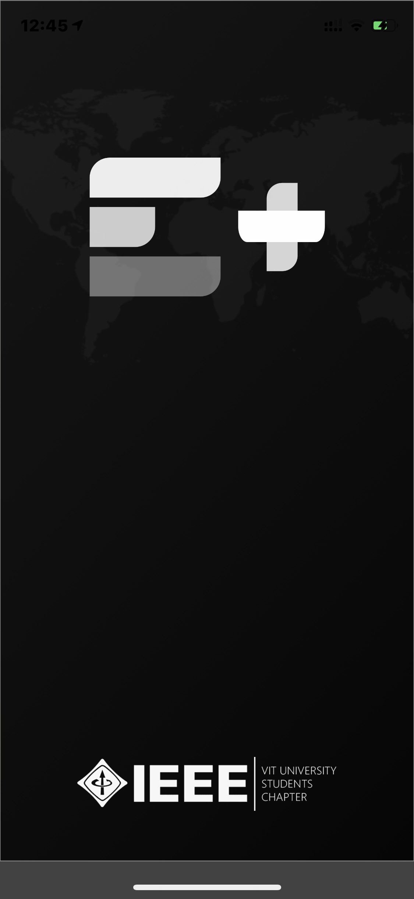
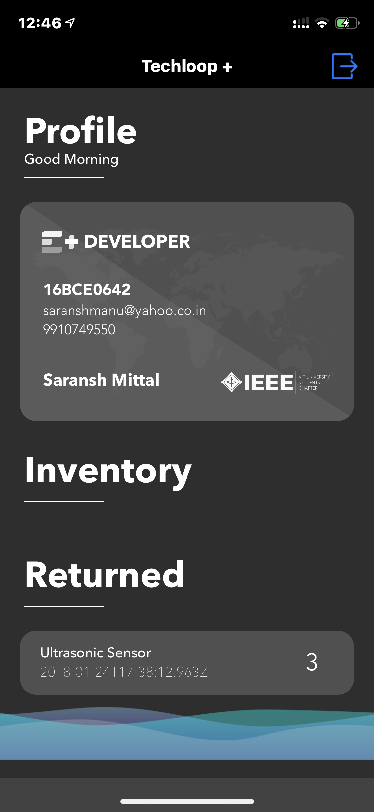
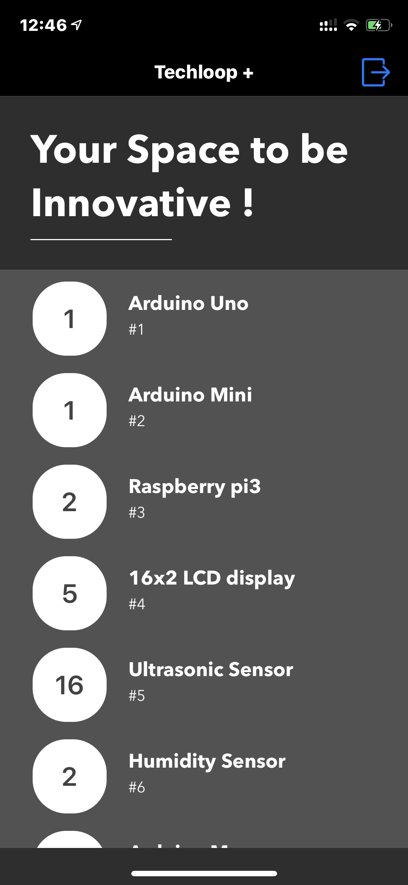
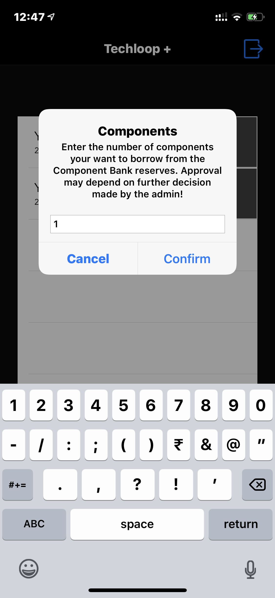

# Techloop Component Bank

### Introduction
IEEE VIT SB maintains an inventory of electric components and issue them to its Techloop E+ members upon request through the application authorised by the admin. The iOS application created keeps track of the borrowed components by a IEEE member and shows the inventory maintained by the organisation. Some of the electronic components are expensive to purchase and to innovate projects based on IoT and other domains that may include use of electric components, these can be borrow by a member for short duration to progress further.

### Application Screenshots

  
  
  
  

## What is IEEE VIT SB?
 

 
IEEE VIT Core Committee is one of the most active chapters inside Region 10 of IEEE International. We boast of highly skilled members in technical and non-technical disciplines. The IEEE Region 10, also sometimes referred as the Asia Pacific Region, comprises of 57 Sections, 6 Councils, 17 Sub-sections, 515 Chapters, 60 Affinity Groups and 958 Student Branches. It covers a geographical area stretching from South Korea and Japan in the north-east to New Zealand in the south, and Pakistan in the west. With over 100,000 members it is one of the largest regions in IEEE.

## What is techloop?
 

 
A one of its kind initiative from IEEE VIT that seeks to proliferate technical skills among students. Topics discussed include
<ul>
  <li>Electronics
  <li>Machine Learning
  <li>Application Development
  <li>Web Development
  <li>Design
</ul>

### Frameworks
<ul>
  <li>Swift 5
  <li>Cocoapods
</ul>

### Cocoapods
<ul>
  <li><a href = "https://github.com/Alamofire/Alamofire">Alamofire</a>
</ul>
